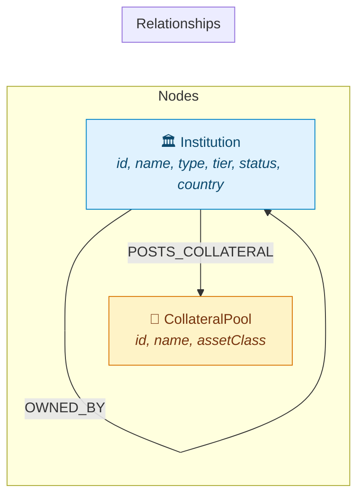

# Wexa Financial Network Contagion Simulator

Visualize and simulate how a single counterparty default ripples through an interconnected financial trading network via direct exposure, shared collateral pools, and ownership structures.

> A graph-powered risk observatory that lets non-technical users explore systemic contagion in real time.

---

## Why a Graph Database?

Counterparty risk contagion is fundamentally a **network traversal problem**. When a financial institution defaults, the damage doesn't stop at its direct counterparties — it cascades through chains of shared exposure, collateral pools, and ownership links that span the entire system. This is exactly what graph databases are designed for.

### What a relational schema cannot do cleanly

| Problem | Relational (SQL) | Graph (CognoDB/Cypher) |
|---|---|---|
| **Variable-depth traversal** — "Find all institutions affected within 5 degrees of a default" | Requires 5 self-JOINs on an adjacency table, or a recursive CTE. Performance degrades exponentially with depth. | `MATCH p = (source)-[:TRADES_WITH\|POSTS_COLLATERAL*1..5]-(target)` — a single, index-free adjacency traversal. Constant time per hop. |
| **Shortest contagion path** — "How does the risk reach Institution X from the defaulted entity?" | No native shortest-path. Requires BFS implementation in application code or complex recursive CTEs. | `shortestPath((from)-[*1..5]-(to))` — built-in, optimized graph algorithm. |
| **Mixed relationship traversal** — "Traverse across trading exposure AND shared collateral pools simultaneously" | Requires UNION of multiple JOIN chains across different link tables, then deduplication. | Pattern matching naturally traverses heterogeneous edge types in one query. |
| **Path-type classification** — "Was this contagion via direct trading, collateral, or a mix?" | Requires storing and aggregating relationship metadata across recursive CTE levels. | `[r IN relationships(p) | type(r)]` extracts the full relationship chain inline. |

**Bottom line:** A relational database can model financial institutions and their connections, but *querying the contagion cascade* — the core value of this application — requires graph-native operations (variable-length path matching, shortest path, relationship-type filtering across hops) that would be awkward, slow, and fragile in SQL.

---

## Data Model



### Node Labels

| Label | Properties | Description |
|---|---|---|
| `Institution` | `id`, `name`, `type` (Bank/HedgeFund/Broker/Insurer/Corporate), `tier` (Tier1–3), `status` (Healthy/Stressed/Defaulted), `country` | A financial entity in the network |
| `CollateralPool` | `id`, `name`, `assetClass` (CorporateBonds/Sovereign/Equities/MBS) | A shared pool of collateral assets |

### Relationship Types

| Type | Direction | Properties | Meaning |
|---|---|---|---|
| `TRADES_WITH` | Institution → Institution | `exposure` (USD) | Bilateral trading/derivatives exposure |
| `POSTS_COLLATERAL` | Institution → CollateralPool | — | Institution pledges assets to a shared pool |
| `OWNED_BY` | Institution → Institution | — | Ownership/subsidiary relationship |

### Dataset Scale

- **25 Institutions** across 6 types (Banks, Hedge Funds, Brokers, Insurers, Corporates)
- **12 Collateral Pools** across 4 asset classes
- **40+ TRADES_WITH** relationships with realistic exposure amounts ($1M–$100M)
- **30+ POSTS_COLLATERAL** relationships
- **6 OWNED_BY** relationships

---

## Main Queries Explained

### 1. Full Network Graph — `GET /api/network`

```cypher
MATCH (n) WHERE n:Institution OR n:CollateralPool
OPTIONAL MATCH (n)-[r]->(m) WHERE m:Institution OR m:CollateralPool
RETURN collect(DISTINCT { id: n.id, label: labels(n)[0], ... }) AS nodes,
       collect(DISTINCT { source: startNode(r).id, target: endNode(r).id, type: type(r), exposure: r.exposure }) AS edges
```

**Rationale:** Single-roundtrip query that fetches the entire graph topology for the force-directed visualization. Uses `OPTIONAL MATCH` so isolated nodes (no outgoing edges) are still returned.

### 2. Contagion Simulation — `POST /api/simulate-default` ⭐ Multi-hop traversal

```cypher
MATCH (source:Institution { id: $institutionId })
MATCH p = (source)-[:TRADES_WITH|POSTS_COLLATERAL*1..5]-(target:Institution)
WHERE target.id <> $institutionId
WITH target, min(length(p)) AS minHop,
     collect(DISTINCT [r IN relationships(p) | type(r)]) AS allRelTypes
RETURN target.id AS id, target.name AS name, minHop AS hopDistance,
       CASE WHEN ... END AS pathType
ORDER BY hopDistance ASC
```

**Rationale:** This is the core graph query that a relational database would find extremely awkward. It performs a **variable-length traversal up to 5 hops** across two different relationship types simultaneously, computes the **minimum hop distance** for each affected institution, and classifies the **path type** (direct trading, collateral, or mixed) — all in a single Cypher query.

### 3. Shortest Contagion Path — `GET /api/path?from=X&to=Y` ⭐ Graph-native algorithm

```cypher
MATCH (from:Institution { id: $fromId })
MATCH (to:Institution { id: $toId })
MATCH p = shortestPath((from)-[:TRADES_WITH|POSTS_COLLATERAL|OWNED_BY*1..5]-(to))
RETURN [r IN relationships(p) | { fromId: startNode(r).id, toId: endNode(r).id, relType: type(r) }] AS steps
```

**Rationale:** Uses Neo4j's built-in `shortestPath()` algorithm to find the exact chain of hops connecting a defaulted institution to a downstream victim. The UI renders this as a step-by-step transmission vector timeline. This query is impossible to express cleanly in SQL without implementing BFS in application code.

### 4. Institution Detail — `GET /api/institutions/:id`

```cypher
MATCH (i:Institution { id: $id })
RETURN { id: i.id, name: i.name, type: i.type, tier: i.tier, status: i.status, country: i.country } AS institution
```

**Rationale:** Simple property lookup by indexed ID. Used by the Inspector Panel to fetch profile metadata for the selected node.

---

## Architecture & Tech Stack

### Backend
- **Runtime**: Node.js (ESM) with TypeScript
- **Framework**: Express 5
- **Database**: CognoDB (Neo4j-compatible) via official `neo4j-driver` (Bolt protocol)
- **Validation**: Zod (schema-based runtime validation for params, query, body)
- **Logging**: Winston structured logging + Morgan HTTP request logging
- **Reliability**: Graceful shutdown manager with signal trapping (`SIGTERM`, `SIGINT`), connection pooling, and health checks

### Frontend
- **Framework**: React 19 with TypeScript
- **Build Tool**: Vite 8
- **Styling**: Tailwind CSS 4
- **Graph Visualization**: `react-force-graph-2d` (D3 force simulation on HTML Canvas)
- **Icons**: Lucide React

### Project Structure

```
wexa/
├── server/
│   └── src/
│       ├── app.ts                    # Express app setup, middleware, routes
│       ├── server.ts                 # Entry point, startup, graceful shutdown
│       ├── seed.ts                   # Database seeding script
│       ├── db/driver.ts              # CognoDB driver singleton, session management
│       ├── router/                   # Route definitions
│       ├── controller/               # HTTP request handlers
│       ├── services/                 # Business logic layer
│       ├── repo/                     # Cypher queries (data access layer)
│       ├── middleware/               # Error handling, validation, logging
│       ├── validations/              # Zod schemas
│       ├── types/                    # TypeScript type definitions
│       └── utils/                    # Config, logger, error classes, shutdown
├── client/
│   └── src/
│       ├── App.tsx                   # Main application component
│       ├── services/api.ts           # API client
│       ├── types/graph.types.ts      # Shared TypeScript types
│       ├── components/
│       │   ├── graph/                # NetworkGraph, canvas rendering
│       │   ├── panels/               # InspectorPanel, HelpView
│       │   └── common/               # Navbar, Legend
│       └── index.css                 # Design system tokens
└── README.md
```

### Architectural Decisions

**Raw Parameterized Cypher over OGM/Query Builders:**
- **Transparency**: Graph traversals remain explicit and easy to optimize.
- **Performance**: Leverages native Cypher execution plan caching through `$param` bindings.
- **Isolation**: Each query is encapsulated in its own named repository function.

**Resilient Database Driver Lifecycle:**
- Connection pooling with health pings on startup (`RETURN 1`) to fail fast on misconfiguration.
- `withSession` wrappers guarantee session disposal and prevent connection leaks.
- `withDbErrorBoundary` maps connection failures to clean 503 responses.

---

## API Endpoints

| Method | Endpoint | Description |
|---|---|---|
| `GET` | `/api/network` | Full force-directed graph (all nodes and edges) |
| `GET` | `/api/institutions/:id` | Institution profile details |
| `POST` | `/api/simulate-default` | Contagion simulation via `*1..5` multi-hop traversal |
| `GET` | `/api/path?from=X&to=Y` | Shortest contagion path between two institutions |
| `GET` | `/api/health` | System health check (Express + CognoDB connectivity) |

---

## Setup & Run

### Prerequisites
- Node.js >= 20.x
- npm >= 10.x

### 1. Create a CognoDB Cloud Instance

1. Sign up at [console.cognodb.com/signup](https://console.cognodb.com/signup) (free, no credit card required).
2. Create a **free (c0) instance** and select a region. It provisions in under a minute.
3. **Copy your connection details immediately:**
   - Connection URI: `bolt+s://<instance-id>.databases.cognodb.cloud`
   - Username: `cognodb`
   - Password: *(shown once at creation)*

### 2. Server Setup

```bash
cd server
npm install

# Configure environment variables
cp .env.example .env
# Edit .env with your CognoDB URI, username, and password

# Seed the database with sample financial network data
npm run seed

# Start the development server (hot-reload via nodemon)
npm run dev
```

### 3. Client Setup

```bash
cd client
npm install

# Start the Vite dev server
npm run dev
```

The client runs on `http://localhost:5173` and proxies API calls to `http://localhost:3000`.

### 4. Production Build

```bash
# Server
cd server && npm run build && npm start

# Client
cd client && npm run build && npm run preview
```

---

## Screenshots


---

## Live Demo

> *TODO: Add hosted demo link here before submission.*

---

## Screen Recording

[Watch the Contagion Simulation Demo on YouTube](https://www.youtube.com/watch?v=rZG8qmilotk)

---

## License

MIT
